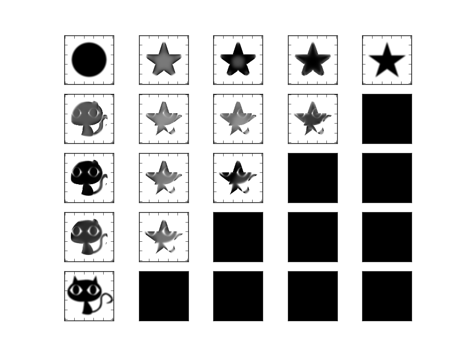

# conv_wasserstein_dist
Convolutional Wasserstein Distances, in Python, based on a lot of peoples work.

So, basically this uses, a Wasserstein distance to calculate barycenters of distributions. The idea being that the correct method for finding a barycenter in the space of probability is solving an optimization problem that results in alternating descent to find to vectors v,w.
This makes finding the 'mean' of distributions a question of minimizing a mix KL Divergences, which results in an iterative solution using a Sinkhorn method.

May implement for 3d voxels in GL and CUDA.
